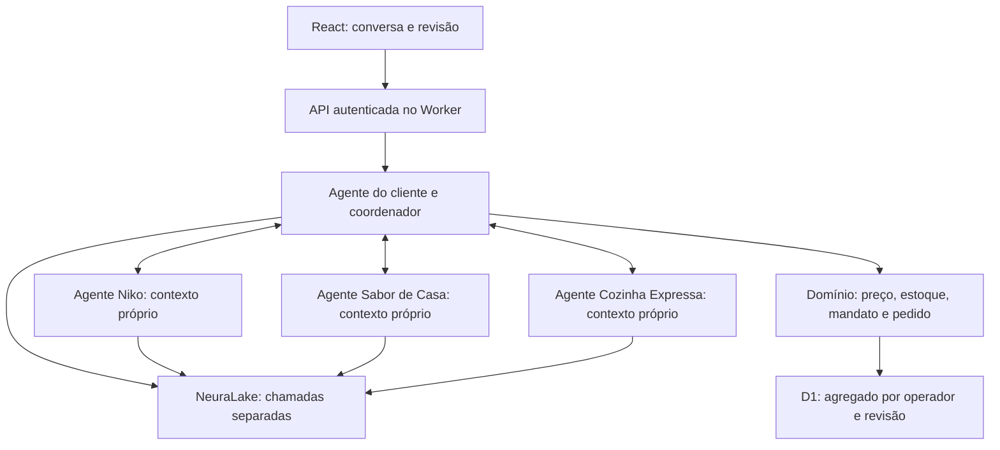

# Fundação do MVP e integração dos quatro agentes

Análise de `origin/main` em `f5d3b670855c40ecb92ef5953e707a93801d3795` (release 0.3.0).
Branch de trabalho: `feature/customer-agent-foundation`. O checkout documental anterior foi preservado.
O pedido atual e os três anexos recebidos durante esta rodada orientam esta revisão.
Atualização: a rodada seguinte amplia o mercado simulado e torna o input humano no
agente do cliente a entrada do fluxo. Os trechos de estado encontrado abaixo são
históricos; o fluxo e os contratos registram o código atual.

## 1. Estado encontrado

| Área | Evidência no repositório | Situação ao iniciar |
|---|---|---|
| Frontend | `components/workspace.tsx`, marketplace, pedidos, ajustes e voz | Implementado, React/TypeScript |
| Backend | `app/api/v1/[...path]/route.ts` | API no mesmo Worker; comandos Zod e SSE finito |
| Dinheiro | `lib/domain/money.ts`, `pricing.ts` | Implementado com BigInt racional e centavos |
| Comércio | `commerce.ts`, `transaction.ts` | RFQ, contraproposta, ranking, mandato e pedido sandbox |
| Estoque | commands/pricing/commerce | Reserva, consumo, produção e contagem; agregado por insumo |
| Persistência | D1 + `workspaces(owner_id, revision, data, updated_at)` | Uma linha JSON por operador; CAS otimista |
| Restaurantes | Fixtures `niko`, `casa`, `panela` | Três serviços determinísticos; não eram três LLMs |
| Cliente | Formulário e orquestração comercial | Sem conversa com NeuraLake |
| NeuraLake | `lib/adapters/neuralake.ts` | Parser de receita local e adapter não conectado |
| Fiscal | XML + fixture, deduplicação e recebimento | Subconjunto implementado; sem QR/SEFAZ ao vivo |
| Voz | BrowserCapture e speechSynthesis | Implementado no navegador; Agora mock |
| Testes | domínio e ciclo de voz; script de API; CI | Existentes; evidências antigas não substituem nova execução |
| Publicação | `.openai/hosting.json`, Sites/Vinext/D1 | Configuração existente; sem novo deploy nesta rodada |

Não há razão concreta para reescrever o domínio, migrar para Python ou trocar o banco
durante o hackathon. O exemplo Python descreve o protocolo HTTP; não exige um segundo backend.

## 2. Problemas prioritários

1. Os quatro exemplos contêm credenciais literais. O responsável autorizou usar as chaves
   atuais: configurar somente em `.dev.vars` ignorado pelo Git ou em secrets do servidor.
   Não é preciso substituí-las para integrar; os exemplos versionados ficam sem valores.
2. Instruções de papel estão em `user`, abaixo de um system genérico. O histórico ainda inclui
   uma resposta pronta; a do Niko anuncia ofertas/combos sem catálogo. Remover esse histórico
   e colocar o papel no system de cada agente.
3. `stream=true` não é Python válido; o limite de 127232 tokens é desproporcional à extração.
   A integração TypeScript usa uma chamada não streaming, limite 512 e timeout 15 s.
4. Não existem tools, schemas, sessões ou roteamento nos snippets. Quatro chaves ou prompts
   diferentes não garantem isolamento: o backend precisa limitar contexto e destinatários.
5. IDs dos exemplos (`restaurante_1/2/3`) divergem da base existente. Mapeamento explícito abaixo.
6. `CAPACITY_PROTECTION` foi descrita no prompt, mas o domínio só implementa BALANCED e
   SURPLUS_FIRST. Preservar as políticas existentes; não transformar nome de estratégia em regra real.
7. O Trello ainda descrevia PostgreSQL/FastAPI e criação de componentes que já existem.
   Repriorizado para integração/validação, preservando cards, links e critérios do guia.
8. Autenticação depende da identidade encaminhada por Private Sites. Um Worker público que
   confie em um header enviado pelo visitante não seria uma alternativa equivalente.
9. D1 contém agregado JSON, não tabelas normalizadas por entidade. É suficiente para cenários
   pequenos isolados, mas histórico/idempotência crescem e cada escrita concorre pelo agregado.

## 3. Arquitetura suficiente para o hackathon



Um frontend, uma API, um banco, um deploy. Agentes são módulos do backend. Não há rede
direta entre restaurantes nem memória global. `shared` compartilha código, nunca histórico,
credenciais ou dados comerciais. Não criar framework, broker ou serviço de agentes separado.

Nesta entrega o LLM do comprador extrai intenção e escolhe ferramentas de rascunho/consulta.
Cada LLM de restaurante escolhe publicar uma proposta calculada ou recusar. A cotação,
contraproposta, ordenação e reserva permanecem nos serviços determinísticos existentes.
Isto não é um loop livre de negociação entre quatro modelos nem conformidade A2A pública.

## 4. Estrutura adotada

```text
app/api/v1/[...path]/route.ts  # manter fronteira HTTP existente
components/customer-conversation.tsx
components/marketplace.tsx    # revisão e autorização existentes
lib/agents/
  customer/
    prompt.ts                # papel e decisões permitidas
    schemas.ts               # turno, patch, sessão
    state.ts                 # estado inicial compatível com dados antigos
    menu.ts                  # cardápio público com preço/disponibilidade calculados
    tools.ts                 # propor rascunho / consultar ofertas
    service.ts               # contexto, inferência, validação e CAS
    negotiate.ts             # comprador coordena os três restaurantes
  restaurants/
    prompts.ts               # três identidades separadas
    service.ts               # publicar oferta própria ou recusar
    README.md
  shared/
    config.ts                # credencial por identidade
    neuralake.ts             # HTTP compatível com chat completions
    contracts.ts             # RFQ/oferta pública e projeções explícitas
    router.ts                # somente buyer↔restaurante
    telemetry.ts             # uso confirmado, sem custos inventados
lib/domain/
  demo-market.ts             # 12 pratos/16 insumos; preparação idempotente
  meal-intent.ts             # vocabulário conservador, sem substituição silenciosa
                             # demais regras existentes preservadas
lib/server/repository.ts     # persistência existente
db/ + drizzle/               # schema e migrações existentes
tests/agents.test.ts          # integração com fakes e isolamento
tests/demo-market.test.ts     # fichas, estoque, compatibilidade e idempotência
```

O adapter antigo continua responsável pelo parser mock da receita. O novo transporte
NeuraLake não substitui essa funcionalidade silenciosamente. Não reordenar pastas de UI.

## 5. Fluxo do cliente

1. A experiência abre com conversa vazia. A pessoa envia sua própria mensagem; exemplos
   e rascunhos não autorizam compra nem disparam os restaurantes por carregamento da página.
2. UI envia mensagem + expectedVersion + Idempotency-Key a `/api/v1/customer-agent`;
   API deriva o operador autenticado e não aceita ownerId no corpo.
3. No primeiro turno válido, `ensureDemoMarket` prepara 12 fichas e 16 insumos no estado
   da transação, preservando dados anteriores. Falha de inferência não grava essa preparação.
4. NeuraLake recebe system próprio, rascunho, últimos oito turnos do comprador e cardápio
   público calculado; não recebe custos, saldos, política privada ou secrets dos restaurantes.
5. Modelo escolhe `propose_request`, `consult_menu` ou `inspect_offers` em JSON.
   Zod rejeita campos extras. O backend produz preços e a resposta pública do cardápio.
6. Tool atualiza rascunho ou consulta dados públicos; modelo não recebe ferramenta de compra.
   A gramática `meal-intent` impede apagar termos desconhecidos da refeição.
7. Backend persiste sessão e resultado idempotente com CAS; resposta inválida não grava.
8. Cliente revisa os dados no formulário. Copiar não compra nem cria mandato.
9. Autorização explícita permite tentar uma compra sandbox. API cria RFQ e `agent_negotiate` consulta
   três contextos separados; domínio contrapropõe, escolhe e reserva dentro do mandato.

Quando a intenção identifica um prato do cardápio, `RFQ.dishName` exige esse prato nas
ofertas. A busca considera versões atuais das fichas e aceita o lote pré-produzido do
mesmo prato. Uma intenção como “pizza de queijo” é rejeitada pelo vocabulário da demo;
não pode virar macarrão com queijo pela coincidência de ingrediente.

Suporte atual: uma porção, BRL, menor total, região de teste Butantã; sem garantias de
alergênicos. Quantidade/região não suportada mantém impedimento explícito.
Um rascunho extraído é uma proposta sujeita à revisão humana, nunca dado financeiro autorizado.

Sessão: `version`, `draft`, últimos 12 turnos, chamadas e última usage; persistida no agregado
do operador. Inferência ocorre fora de CAS e não é repetida automaticamente por conflitos.
Após conflito a UI atualiza a conversa; em falha mantém o texto e reutiliza a chave no retry.
Uma repetição concorrente ainda pode consumir duas inferências; só uma gravação é aceita.
Rate limiting distribuído não foi adicionado; esta é uma demo privada, com quotas no provedor.

**Novo pedido** envia `{reset: true, expectedVersion}` com idempotência. Reinicia somente
rascunho e turnos; preserva pedidos, saldos, reservas, mandatos, histórico e quota de chamadas.
Não executa inferência, não carrega fixtures novamente e não compra.

## 6. Comunicação e isolamento dos restaurantes

| Exemplo recebido | Identidade interna preservada | Secret |
|---|---|---|
| Cliente | buyer | NEURALAKE_CUSTOMER_API_KEY |
| Marmita Quentinha do Seu Niko / restaurante_1 | niko | NEURALAKE_NIKO_API_KEY |
| Sabor de Casa / restaurante_2 | casa | NEURALAKE_CASA_API_KEY |
| Cozinha Expressa / restaurante_3 | panela | NEURALAKE_PANELA_API_KEY |

Novos cenários usam os nomes recebidos: Sabor de Casa e Cozinha Expressa. Os nomes antigos
podem aparecer em cenários já persistidos. Identidade e
associação de pedidos usam IDs, não comparação pelo nome. Não migrar dados antigos por estética.

O roteador recebe o remetente do código confiável do servidor. A saída do modelo não pode
escolher remetente, destinatário ou tenant. Cada restaurante recebe uma RFQ pública e apenas
suas ofertas calculadas, em uma chamada com contexto novo. Não recebe histórico de colegas,
orcamento, mandato, endereço privado, chaves ou ofertas concorrentes.
O retorno aceita somente oferta do conjunto permitido ou recusa padronizada, sem texto livre
que possa transmitir dados privados. Falha de qualquer provedor aborta esta rodada de compra;
não há fallback live→mock automático.

`agent_negotiate` é um comando de comprador autenticado. Não há endpoint genérico para
restaurantes trocarem mensagens entre si. O mesmo operador da demo representa os personagens;
isso não equivale a autenticação comercial multiusuário por restaurante.

## 7. Contratos principais

| Contrato | Campos | Autoridade |
|---|---|---|
| CustomerTurn | message + expectedVersion OU reset:true + expectedVersion | Entrada HTTP estrita; identidade fora do corpo |
| CustomerDraft | description, budget decimal em reais, portions, prazo, região, exclusões, pendência alimentar | Não confirmado |
| AgentDecision | propose_request + patch OU inspect_offers OU consult_menu | Lista de ferramentas permitidas |
| RestaurantRequest | protocol, rfqId, restaurantId, dishName opcional, required/excluded, quantity=1, zone, maxMinutes, expiresAt | Projeção do backend; sem orçamento |
| RestaurantOffer | offerId, RFQ/restaurante/receita, versão, composição, preço, prazo, validade, SANDBOX | Projeção de Offer do domínio |
| PriceQuote | subtotalCents, deliveryCents, buyerFeeCents, totalCents | Inteiros; total validado como soma |
| AgentMessage | kind, from, to, payload | Apenas buyer→restaurante ou restaurante→buyer |
| MenuItem / Ingredient | Projeções dos tipos Recipe e Stock; publicMenu inclui nome, composição, disponibilidade, preço total e prazo | Sem custo, política ou saldo exato |
| OrderIntent | Representado por CustomerDraft seguido de Mandate confirmado | Não criar entidade paralela |
| Pedido | Order existente, ligado a Offer/RFQ/Mandate | CAS do backend; nunca resultado textual do LLM |

Exemplo público:

```json
{"kind":"request","from":"buyer","to":"niko","payload":{"protocol":"ibyara.exchange.v1","rfqId":"rfq_exemplo","restaurantId":"niko","required":["patinho","arroz","feijao"],"excluded":[],"quantity":1,"zone":"demo_butanta","maxMinutes":40,"expiresAt":"2026-09-20T12:00:00.000Z"}}
```

IDs e timestamp acima são ilustrativos. Tokens de aceite permanecem com o backend/UI
autorizada, não com os modelos. Schemas validam formato; domínio revalida disponibilidade e mandato.

## 8. Modelo mínimo de dados

Manter `workspaces` no D1 agora. A API já deriva `owner_id`; não criar tabela de usuários
com dados pessoais sem necessidade. Não há tabela nova nem migração SQL nesta rodada:
`customerAgent`, `inference` e `demoMarketVersion` são extensões opcionais do JSON
versionado, com defaults. `RFQ.dishName` também é opcional e mantém dados antigos legíveis.

O cenário expandido tem quatro pratos em cada restaurante e 16 insumos reconhecidos.
Os “bancos de cada restaurante” são conjuntos lógicos `restaurants[id]` dentro do D1
existente, com fichas, custos e estoque próprios. Não existem três bancos físicos.
A preparação ocorre uma única vez e nunca repõe um saldo consumido nem renova validade.
Detalhamento e cardápios: `docs/DEMO-MARKET.md`.

Relacionamentos dentro do agregado:

- operador → três Restaurant; restaurante → Recipe versionada, Stock e Policy versionada;
- Recipe.components.item → Stock.id do MESMO restaurante; fichas preservam unidades/base/rendimento;
- Mandate → RFQ → Offer → Order; Offer referencia restaurante, receita e versão;
- Purchase → linhas de insumos; recebimento confirmado atualiza estoque/custo;
- CustomerSession → rascunho, turnos e uso do comprador; mensagens comerciais referenciam RFQ;
- Event → sequência e correlationId; idempotency → digest e resultado da operação.

IDs de insumos como `patinho` são locais ao catálogo/restaurante, não chaves globais de saldo.
Se o piloto exigir estoque compartilhado entre compradores, normalizar em users, restaurants,
recipes/recipe_components, ingredients, stock, policies, mandates, rfqs, offers, orders e
conversation_turns, com FKs compostas por restaurante/operador e migrações aditivas.
Isso é evolução condicional; não implementar agora data lake, warehouse ou streaming.

## 9. Infraestrutura mínima

- **Frontend, API e agentes:** mesmo build Vinext/Cloudflare Worker já adotado.
- **Banco:** D1 existente, migração original preservada.
- **Secrets:** bindings do Worker; `.dev.vars` ignorado no desenvolvimento. Nunca NEXT_PUBLIC_*.
- **Comunicação:** HTTP navegador→API; funções internas tipadas entre módulos; HTTPS para NeuraLake.
- **Atualização:** SSE existente; sem WebSocket, fila ou broker novo.
- **Local:** Node da `.nvmrc`, pnpm do package.json, install congelado, build, migração local e dev.
- **Demo online:** continuar no ambiente Private Sites existente, usando a publicação configurada;
  aplicar migração apenas em banco novo, registrar quatro secrets no servidor, fazer smoke autenticado
  e ensaio. Um novo deploy depende de decisão de publicação; não foi executado nesta rodada.

Não presumir que `next start`, Vercel ou um Worker público sejam destinos substitutos prontos.
A confiança na identidade do Private Sites e o binding D1 precisam ser preservados.
Não adicionar uma segunda aplicação Python apenas para utilizar o SDK do anexo.

## 10. Prioridades executáveis

**P0:** fundação executável, quatro credenciais autorizadas + smoke real, conversa do cliente com revisão,
roteamento isolado dos três restaurantes, validação de cálculo/reserva/pedido, cadastro/voz,
XML/recebimento, contagem e ensaio/pitch. Os recursos já implementados pedem validação, não reescrita.

**P1:** contratos públicos tipados no frontend e limite/retomada de histórico para sessões longas.
Não bloquear a demonstração para normalizar todo o banco ou construir observabilidade completa.

**P2:** piloto, auth comercial, lotes/estoque compartilhado, QR fiscal ampliado, Agora homologado
quando o fallback não bastar, PDV, previsão, pagamentos/logística reais e interoperabilidade externa.
Voz continua P0: a classificação de Agora não remove o requisito de testar voz do navegador.

## 11. Trello

Quadro: https://trello.com/b/YNokvONE/ibyara-hackathon

Inspeção inicial: 13 cards (12 entregáveis + LINKS), nenhum concluído, nenhum critério marcado;
LINKS era o único card em andamento. Não havia duplicata evidente. Backup antes das alterações:
`docs/evidence/trello-before-foundation.json`. Os 12 entregáveis e o card LINKS foram preservados.
Listas passam a explicitar P0, P1 e P2; andamento/validação/concluído conservam significado.
Detalhes de arquitetura ficam neste documento; cards recebem o que fazer, por quê e aceite.
Nenhum card será concluído só pela existência de código local ou teste com mock.

Após a fundação havia 16 cards, sendo 11 P0, 2 P1, 2 P2 e LINKS. Foram criados apenas três cards:
conversa do cliente, tipos públicos do frontend e limite/retomada do histórico.
Na ampliação dos cardápios e agentes reais, seis descrições receberam evidências e
cinco cards passaram para **Em validação**: fundação, restaurantes, cliente, estoque
e pedido. Verificação do quadro: seis na lista P0, dois na P1, LINKS em andamento,
cinco em validação e dois na P2. Nada foi arquivado ou marcado como concluído.
Voz/equipamento/rede da apresentação e pitch continuam pendentes no card de ensaio.

## 12. Mudanças imediatas e divisão da equipe

Esta rodada adiciona o transporte NeuraLake, configuração por identidade, conversa persistida,
schemas, roteador, publicação controlada de ofertas, UI de revisão e testes. A ampliação
inclui 12 fichas, 16 insumos, consulta pública de cardápio, início por input do cliente,
reset de conversa e seleção conservadora de prato/versão. Preserva o motor de preços,
reservas/baixas, transação D1 e migração. As três estruturas recebidas foram incorporadas;
futuras mudanças de tools devem ser combinadas no contrato compartilhado.

Frentes sem atribuir pessoas: (1) UI/conversa, (2) integração e prompts, (3) domínio/contratos,
(4) ensaio/entrega. Evitar edição simultânea de route.ts, types.ts e lockfile. PRs pequenos.
O Trello substitui Jira/GitHub Issues como backlog desta tarefa.

Limites: a integração usa as chaves atuais autorizadas, armazenadas somente no servidor.
Nesta rodada, 51 testes passaram e o fluxo real dos quatro agentes passou no Worker/D1
local, criando um pedido sandbox de frango por R$ 37,90 com reserva e idempotência.
Os resultados reais estão em `docs/evidence/VALIDATION-LIVE-MARKET.md`.
Isolamento demonstrado é por contexto/operador na aplicação;
retenção e isolamento internos do fornecedor não foram certificados. A aplicação não usa
Cross Memory; confirme também a configuração de memória/retenção no provedor antes da demo real.
`docs/evidence/VALIDATION-AGENTS.md` registra a rodada anterior, com 40 testes e mocks,
e deve permanecer histórico, sem substituir ou reinterpretar aquela execução.
